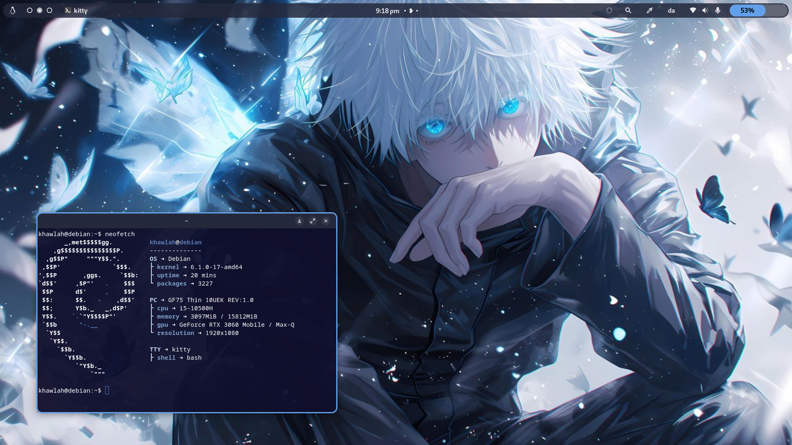
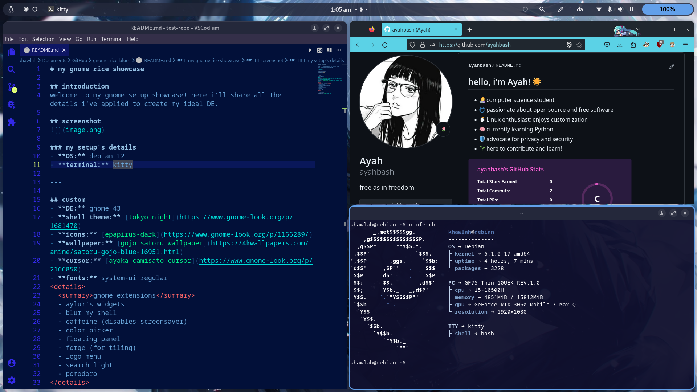

# my gnome rice showcase 🍚💙

## 🫧 introduction 
welcome to my gnome setup showcase! here i'll share all the details i've applied to create my ideal **DE**. this is the blue version i've recently worked on. hope you enjoy! 😄

---
## 📸 screenshots 

  

  

  
  ### ♥️ my setup's details

  - **OS:** debian 12
  - **terminal:** kitty
  - **resolution**: 1920x1080
  

---

## 🍙 custom
- **DE:** gnome 43
- **shell theme:** [tokyo night](https://www.gnome-look.org/p/1681470)
- **icons:** [epapirus-dark](https://www.gnome-look.org/p/1166289/)
- **wallpaper:** [gojo satoru wallpaper](https://4kwallpapers.com/anime/satoru-gojo-blue-16951.html)
- **cursor:** [ayaka camisato cursor](https://www.gnome-look.org/p/2166850)
- **fonts:** system-ui regular

  
 gnome extensions 

  - aylur's widgets
  - blur my shell
  - caffeine (disables screensaver)
  - color picker
  - floating panel
  - forge (for tiling)
  - logo menu
  - search light
  - pomodoro

## 🐱 terminal config
- **kitty:**  [.kitty](kitty.conf)
- **neofetch:** [.config](config.conf)

### 🫐 extras 
- **code editor**: VSCodium
- **theme:** *oxford-blue*

## 🗨️ feedback
yout feedback is welcome! feel free to reach out with suggestions or questions.

--- 
enjoy exploring my gnome setup! 💗
